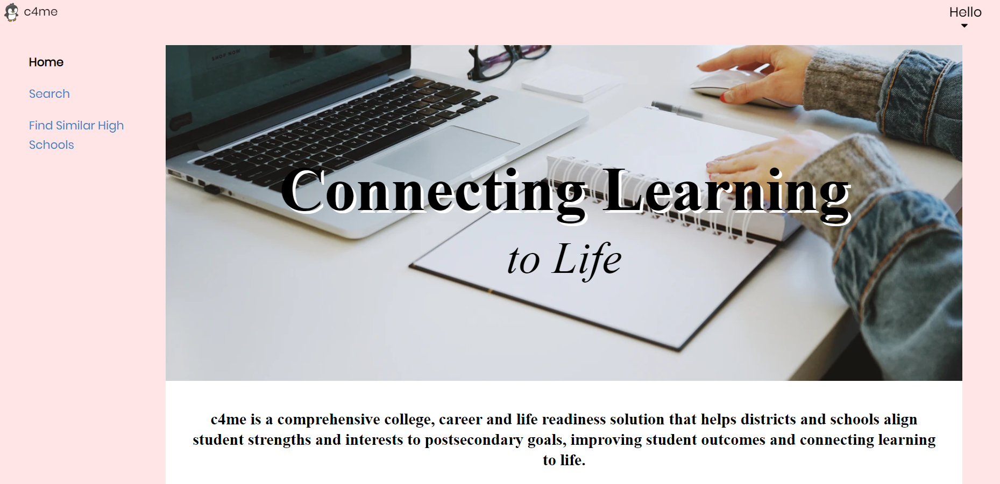
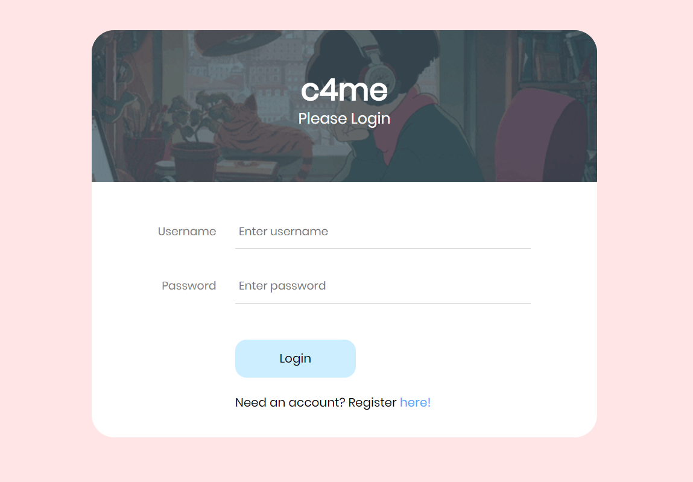
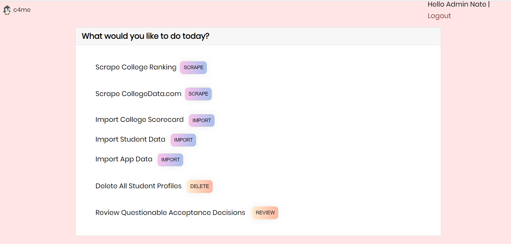
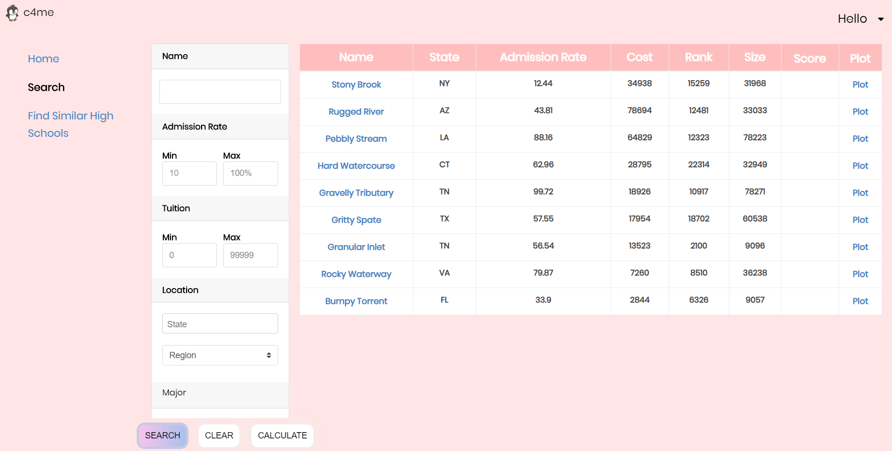
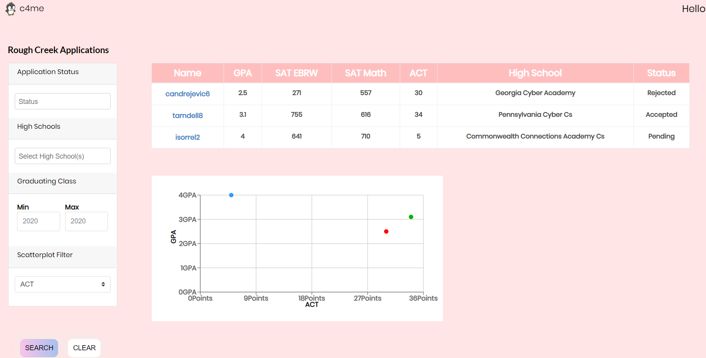

# c4me

### About
c4me is a Full Stack Webapp that allows users to lookup college information, sort through them, gain insights to their 
chances at getting into said schools, and connect with fellow colleagues along the way! 

### Dependencies

Project Setup is simple and easy! First, make sure you have [MySQL](https://dev.mysql.com/downloads/) and[nodeJs](https://nodejs.org/en/download/) installed.
Setting up the frontend and backend from there is easy. Simply change into their respective directory, and type npm install.

For the frontend, run the script necessary to start it via npm start. 

For the backend, simply run via node app.js

Setting up the database after installing MySQL is slightly more involved due to the security features of MySQL. However, once a 
MySQL username is set up, you can create the database through the console or MySQL workbench with the lines [here](https://github.com/jamescastro98/c4me/blob/master/sqlstatements.txt) Please note that your credentials must be written into the config.json file 
[here](https://github.com/jamescastro98/c4me/blob/master/backend/config.json).

### Screenshots

### Credits

Everything great has a team behind it. Here's ours:

[Deanna Liu](https://github.com/deannaliu) - Frontend & Documentation

[James Castro](https://github.com/jamescastro98) - Frontend, Frontend/Backend Connection & Testing, Final Readme

[Joseph Spivack](https://github.com/JoeSpivack) - Backend, Database Setup & Frontend/Backend Connection

[Nathan Chan](https://github.com/SevenNateNine) - Database Setup, Backend & Testing
